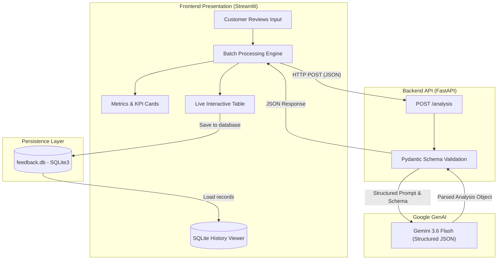

# 📝 Customer Feedback Analyzer

An intelligent, full-stack customer review and sentiment analysis platform. Powered by **Google Gemini 3.6 Flash**, **FastAPI**, and **Streamlit**, this application transforms unstructured customer feedback into structured, actionable business intelligence with persistent SQLite historical tracking.

[](https://www.python.org/)
[](https://fastapi.tiangolo.com/)
[](https://streamlit.io/)
[](https://ai.google.dev/)
[](https://github.com/astral-sh/uv)
[](https://www.sqlite.org/)

---

## 🌟 Key Highlights

- **🤖 Zero-Shot AI Review Extraction**: Utilizes Google Gemini 3.6 Flash to parse raw customer reviews into strictly typed JSON schemas with sentiment labels (`positive`, `negative`, `neutral`), 1–5 satisfaction ratings, and one-word topic themes.
- **⚡ Decoupled Microservice Architecture**: Features a dedicated FastAPI backend API for inference, enabling the frontend, mobile apps, or automated webhook pipelines to reuse the same analysis engine.
- **📊 Interactive Business Intelligence Dashboard**: A responsive Streamlit frontend tailored for business owners to paste batch reviews, inspect live data tables, and review key operational metrics.
- **📈 Aggregate Analytics**: Computes real-time KPIs including total reviews processed, average satisfaction rating, percentage of positive sentiment, and the single most recurring feedback theme.
- **💾 Historical Archival (SQLite)**: Save analysis runs to a local SQLite database (`feedback.db`) with an integrated audit viewer for retrospective feedback analysis.
- **🛡️ Fault-Tolerant Processing**: Batch analysis gracefully flags individual network or parsing anomalies without interrupting the remaining review pipeline.

---

## 🏗️ System Architecture



---

## 📁 Repository Structure

```text
Customer_FeedBack_analyzer/
├── .env                       # Environment variables (GEMINI_API_KEY)
├── .gitignore                 # Git ignore rules
├── Sample_reviews.txt         # Pre-configured test reviews for quick evaluation
├── api.py                     # FastAPI backend service exposing /analysis
├── app.py                     # Streamlit frontend analytics dashboard
├── database.py                # SQLite database management (init, save, query)
├── feedback.db                # SQLite database storing processed feedback
├── pyproject.toml             # Project configuration and dependency specifications
├── uv.lock                    # Deterministic lockfile for reproducible builds
└── src/
    └── feed_analyzer/
        └── __init__.py        # Package entry point
```

---

## 🛠️ Technology Stack

| Layer | Component | Description |
| :--- | :--- | :--- |
| **Backend API** | [FastAPI](https://fastapi.tiangolo.com/) | Asynchronous, high-performance REST API with automated OpenAPI docs |
| **AI / LLM** | [Google GenAI SDK](https://github.com/googleapis/python-genai) | Official SDK accessing `gemini-3.6-flash` with structured output constraints |
| **Data Validation** | [Pydantic v2](https://docs.pydantic.dev/) | Strict input/output type contracts (`Review` and `Analysis`) |
| **Frontend UI** | [Streamlit](https://streamlit.io/) | Interactive web UI with real-time KPI metrics and dataframes |
| **Database** | [SQLite3](https://docs.python.org/3/library/sqlite3.html) | Zero-configuration file-based relational store |
| **Package Manager** | [uv](https://github.com/astral-sh/uv) | High-speed Python package resolver and environment manager |

---

## 🚀 Quickstart Guide

### 1. Prerequisites

- **Python 3.12+**
- **Google Gemini API Key**: Obtain one from [Google AI Studio](https://aistudio.google.com/).
- **uv** (recommended) or standard `pip`.

### 2. Clone and Setup Environment

Clone the repository and switch to the project folder:

```bash
git clone <your-repository-url>
cd Customer_FeedBack_analyzer
```

Create and activate a virtual environment:

**Using `uv` (Recommended):**
```bash
uv sync
```

**Using standard Python:**
```bash
python -m venv .venv
# On Windows (PowerShell):
.venv\Scripts\Activate.ps1
# On macOS/Linux:
source .venv/bin/activate

pip install -r pyproject.toml
```

### 3. Configure API Credentials

Create a `.env` file in the project root:

```env
GEMINI_API_KEY=your_actual_google_gemini_api_key_here
```

---

## 💻 Running the Services

The application operates as a decoupled client-server architecture. Run the backend and frontend in separate terminals.

### Step 1: Start the FastAPI Backend

In **Terminal 1**, run:

```bash
# Using uv
uv run fastapi dev api.py

# Or using uvicorn directly
uv run uvicorn api:app --reload --host 127.0.0.1 --port 8000
```

- **API Base URL**: `http://127.0.0.1:8000`
- **Interactive Swagger Docs**: `http://127.0.0.1:8000/docs`
- **Alternative ReDoc UI**: `http://127.0.0.1:8000/redoc`

### Step 2: Start the Streamlit Frontend

In **Terminal 2**, launch the dashboard:

```bash
# Using uv
uv run streamlit run app.py
```

Open your browser and navigate to:
```text
http://localhost:8501
```

---

## 📖 Usage Walkthrough

1. **Input Reviews**: In the Streamlit dashboard, paste customer reviews into the text box (one review per line). You can use the provided [`Sample_reviews.txt`](Sample_reviews.txt) for immediate testing.
2. **Execute Analysis**: Click the **Analyze** button. The app communicates with the FastAPI service for each review.
3. **Inspect Output**:
   - **Data Table**: View the granular output table displaying review text, classification (`positive` / `negative` / `neutral`), numeric score (`1` to `5`), and detected thematic category (`delivery`, `taste`, `price`, etc.).
   - **Business Summary**: Instantly observe total volume, average review score, positive satisfaction rate (%), and the primary topic customers mention most frequently.
4. **Persist Records**: Click **💾 Save to database** to archive the session results into `feedback.db`.
5. **View History**: Expand **📚 Saved history** to browse all historical entries logged over time.

---

## 📡 API Specification

### Endpoint: `POST /analysis`

Accepts a single customer review and returns structured sentiment analysis.

#### Request Body
```json
{
  "text": "The biryani was delicious and arrived hot and on time!"
}
```

#### Success Response (`200 OK`)
```json
{
  "label": "positive",
  "score": 5,
  "theme": "delivery"
}
```

#### Field Definitions

| Field | Type | Description |
| :--- | :--- | :--- |
| `label` | `string` | Sentiment category: `'positive'`, `'negative'`, or `'neutral'` |
| `score` | `integer` | Satisfaction score rating from `1` (lowest) to `5` (highest) |
| `theme` | `string` | Single lowercase keyword identifying primary subject (e.g., `taste`, `price`, `delivery`, `service`, `quality`) |

---

## 🗄️ Database Schema

The SQLite database (`feedback.db`) is automatically initialized upon startup using the following schema:

```sql
CREATE TABLE IF NOT EXISTS feedback (
    id INTEGER PRIMARY KEY,
    review TEXT,
    label TEXT,
    score INTEGER,
    theme TEXT
);
```

---

## 🧪 Sample Evaluation Data

A test suite of sample customer reviews is available in [`Sample_reviews.txt`](Sample_reviews.txt):

```text
The food was delicious but the delivery took over an hour. Not happy.
Amazing taste and the order arrived hot and early. Will order again!
Prices have gone up too much for the same small portion.
Service was rude when I called to ask about my order.
The biryani was perfect, exactly like last time. Very consistent.
Okay food, nothing special. Average experience overall.
Delivery boy was very polite and on time. Good job.
Cold food again. This is the third time the delivery was slow.
Great value for money, big portion and tasty.
The app kept crashing while I was trying to place my order.
```

---

## 🔮 Roadmap

- [ ] **Batch File Upload**: Ingest reviews via `.csv`, `.xlsx`, or `.json` file upload.
- [ ] **Data Visualizations**: Sentiment distribution pie charts and trend lines over time using Plotly.
- [ ] **Export Options**: Export aggregated summaries and filtered queries to CSV or PDF reports.
- [ ] **Multi-Language Support**: Automatic language detection and translation before analysis.
- [ ] **Asynchronous Processing**: Celery / Redis background worker queue for high-volume enterprise ingestion.

---

## 📄 License

This project is open-source and available under the [MIT License](LICENSE).

